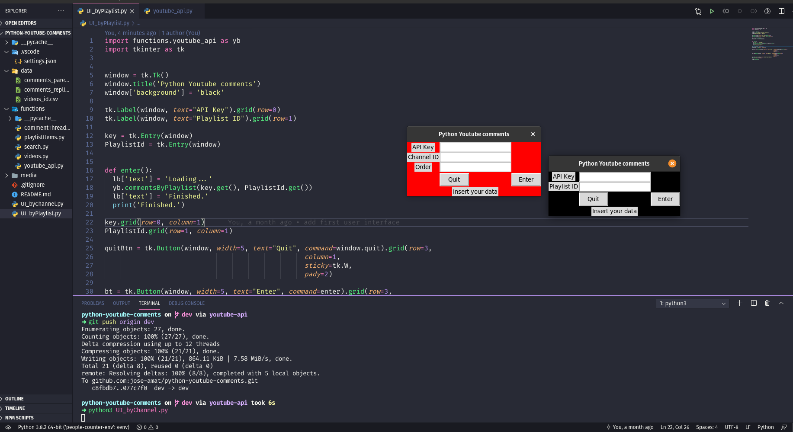

# Python Youtube Comments

This script will help you to extract the youtube comments from a video. We are considering the parent comments with their respectives replies.

## How to execute?

### Videos By Channel Id
```bash
$ python3 UI_byChannelId.py
```
### Videos By Playlist Id
```bash
$ python3 UI_byPlaylist.py
```



## Note
- You have to pass a youtube key. To create it please see [here](https://developers.google.com/youtube/v3/docs).
- You have to pass the URL with this format: https://www.youtube.com/watch?v=CWeffUwlbUA
- Both tables will be saved in the Data folder.